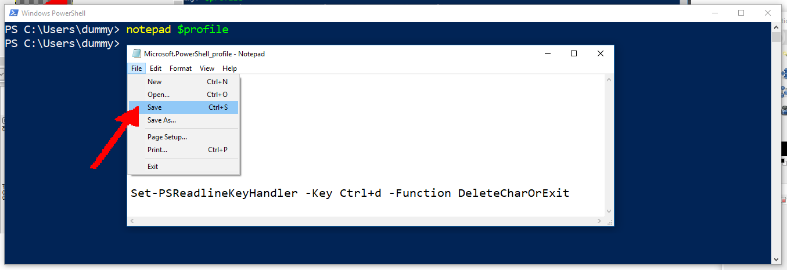

<h1>Setup PowerShell (PS) for<br>WSL (Windows Subsystem for LaTeX :)</h1>


*PowerShell* (untuk selanjutnya **PS**), harus sedikit dimodifikasi agar nyaman digunakan untuk WSL (Windows Subsystem for LaTeX eh **LINUX** :).
Sebagian modifikasi lebih mudah dilakukan secara interaktif, sebagian dapat dengan **PS** *command line*,
dan sebagian sebenarnya dapat dimodifikasi dalam mode *BASH*. 
Untuk memodifikasi **PS** *$profile*, perlu meminta izin dalam mode **PS** (Administrator) dengan jawaban "Y":
```PS
Set-ExecutionPolicy RemoteSigned
```


Silakan menutup **PS** dalam *Administrator mode*, serta untuk selanjutnya silakan menggunakan **PS** dalam *user mode*.
Silakan melakukan pengaturan ukuran *cursor* (umpama **Large**), *font* (umpama 24pt), serta *window* (umpama 120 x 30 karakter). 
Silakan klik kanan serta memilih *Properties*.



