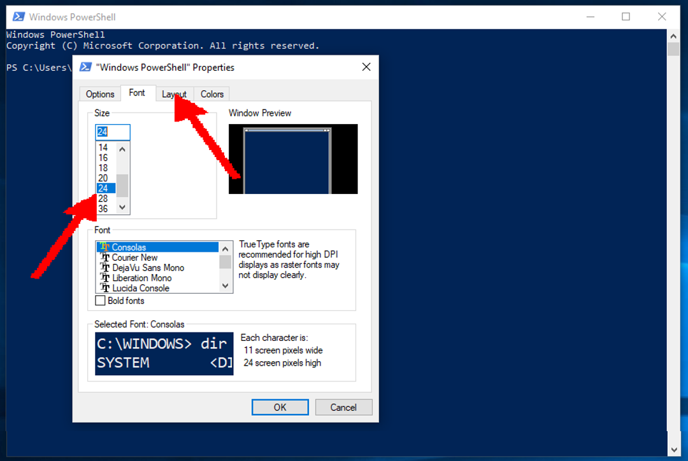

<h1>Setup PowerShell (PS) for<br>WSL (Windows Subsystem for LaTeX :)</h1>


*PowerShell* (untuk selanjutnya **PS**), harus sedikit dimodifikasi agar nyaman digunakan untuk WSL (Windows Subsystem for LaTeX eh **LINUX** :).
Sebagian modifikasi lebih mudah dilakukan secara interaktif, sebagian dapat dengan **PS** *command line*,
dan sebagian sebenarnya dapat dimodifikasi dalam mode *BASH*. 
Untuk memodifikasi **PS** *$profile*, perlu meminta izin dalam mode **PS** (Administrator) dengan jawaban "Y":
```PS
Set-ExecutionPolicy -ExecutionPolicy RemoteSigned
```


Silakan menutup **PS** dalam *Administrator mode*, serta untuk selanjutnya silakan menggunakan **PS** dalam *user mode*.
Silakan melakukan pengaturan ukuran *Cursor Size* (umpama **Large**), *Font Size* (umpama **24pt**), 
serta *Window Size* (umpama **120 x 30** karakter). 
Pertama-tama, silakan klik kanan serta memilih *Properties*.


Setelah memilih *Cursor Size* menjadi **Large**, silakan memilih tab **Font** untuk mengubah *Font Size*.


Setelah memilih *Font Size* menjadi **24pt**, silakan memilih tab **Layout** untuk mengubah *Window Size*.



Dalam *Window Size*, silakan memilih *Height* dan *Width* sesuai dengan keyakinan dan kepercayaan masing-masing.
Untuk contoh ini, *Width* diubah menjadi **30** sehingga *Window Size* menjadi **120 x 30**.
Sebagai penutup, silakan klik **OK**.


Sekarang **PS** *$profile* siap untuk dimodifikasi.
Pertama-tama, kita periksa apakah variabel *$profile* exist:
```PS
$profile
```
Existensi variabel tersebut tidak otomatis berarti berkas *$profile* exist.
Jadi, kita test juga:
```PS
test-path $profile
```
Jika *False*, kita membuat berkas kosong. Karena tidak ada perintah linux *touch*, maka kita gunakan cara **PS**:
```PS
New-Item -path $profile -type file -force
```
Seharusnya, sekarang berkasnya exist (*True*):
```PS
test-path $profile
```


Dengan demikian, kini dapat dilakukan modifikasi **PS** *$profile* sesuai dengan keyakinan dan kepercayaan masing-masing.
Umpamanya, ingin menambahkan agar dapat exit **PS** dengan **CTRL-D**:

```PS
Set-PSReadlineKeyHandler -Key Ctrl+d -Function DeleteCharOrExit
```

Lalu **SAVE**.


> AWAS AWAS AWAS AWAS AWAS AWAS AWAS AWAS AWAS AWAS AWAS AWAS AWAS AWAS AWAS AWAS AWAS AWAS AWAS AWAS AWAS AWAS AWAS AWAS AWAS AWAS AWAS AWAS 
